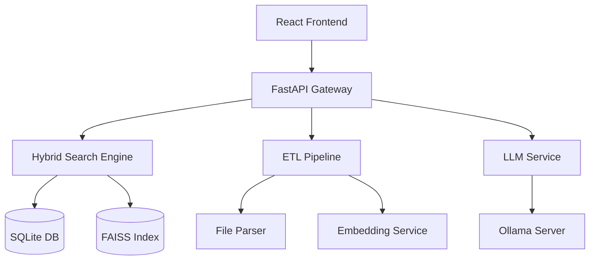

# HanaNaviLite 개발 가이드

이 문서는 HanaNaviLite 프로젝트의 개발 지침과 구현 세부사항을 설명합니다.

---

## 🎯 **개발 철학**

### **1. 경량화 우선**
- 32GB RAM 제약 하에서 최적 성능 달성
- 불필요한 의존성 최소화
- 메모리 사용량 지속적 모니터링

### **2. 자체 구현 중심**
- 핵심 비즈니스 로직은 직접 개발
- 오픈소스는 인프라 레벨에서만 활용
- 한국어 특화 처리 로직 강화

### **3. 실용성 중심**
- MVP 관점에서 필수 기능만 구현
- 확장 가능한 모듈 설계
- 은행 업무 특성 반영

---

## 🏗️ **아키텍처 설계**

### **컴포넌트 구조**



### **데이터 플로우**

1. **인덱싱 플로우**
   ```
   게시글 웹훅 → ETL Pipeline → 파일 파싱 → 청킹 → 임베딩 → FAISS/SQLite 저장
   ```

2. **검색 플로우**
   ```
   사용자 질의 → 하이브리드 검색 → RRF 융합 → 재랭킹 → 컨텍스트 생성
   ```

3. **응답 플로우**
   ```
   컨텍스트 + 질의 → LLM 추론 → 답변 생성 → 후처리 → 사용자 응답
   ```

---

## ✅ **Phase 1 완성 현황**

### **구현 완료 현황**
Phase 1 핵심 인프라가 100% 완성되었습니다:

- ✅ **FastAPI 통합 서비스** (`app/main.py`)
- ✅ **SQLite 통합 데이터베이스** (`app/core/database.py`)
- ✅ **설정 관리 시스템** (`app/core/config.py`)
- ✅ **헬스체크 API** (`app/api/health.py`)
- ✅ **테스트 시스템** (`test_basic.py`, `test_phase1_complete.py`)

### **검증된 기능**
```bash
# 완성도 검증 테스트 결과
🔬 HanaNaviLite Phase 1 Complete Validation
✅ Tests Passed: 9/9
📈 Success Rate: 100.0%
🎉 PHASE 1 IMPLEMENTATION COMPLETE!
```

### **현재 상태**
- **메모리 사용량**: 5.1GB / 25GB 제한
- **데이터베이스**: 7개 테이블 생성 완료
- **API 엔드포인트**: 11개 라우트 구현
- **헬스체크**: 5개 모니터링 엔드포인트

## ✅ **Phase 3 완성 현황**

### **구현 완료 현황**
Phase 3 ETL & LLM 기능이 100% 완성되었습니다:

- ✅ **파일 파서 통합**: PDF, XLSX, DOCX 파일 파싱 기능 통합 및 강화
- ✅ **ETL 파이프라인 구축**: 문서 수집, 파싱, 청킹, 임베딩, 인덱싱 자동화
- ✅ **임베딩 서비스**: SentenceTransformer 모델 기반 실제 임베딩 생성 기능 구현
- ✅ **Ollama 클라이언트**: Ollama LLM 서버와 비동기 통신 클라이언트 구현
- ✅ **RAG 파이프라인**: 하이브리드 검색 결과 기반 LLM 답변 생성 파이프라인 구축
- ✅ **답변 생성 API**: RAG 파이프라인을 노출하는 FastAPI 엔드포인트 구현

### **검증된 기능**
- ETL 파이프라인을 통한 문서 처리 및 인덱싱
- RAG API를 통한 LLM 기반 질의응답

### **현재 상태**
- **ETL**: 문서 업로드 및 자동 처리 가능
- **LLM**: Ollama 서버와 연동하여 답변 생성 가능
- **API 엔드포인트**: `/api/v1/rag/query` 및 `/api/v1/rag/stream_query` 사용 가능

---

## 🔧 **핵심 모듈 설계**

### **1. FastAPI Gateway (`app/core/`) - ✅ 완성**

**역할**: 모든 요청의 진입점 및 라우팅  
**상태**: ✅ **완전 구현 완료**

**구현된 기능**:
- ✅ FastAPI 앱 생성 및 라이프사이클 관리
- ✅ CORS 미들웨어 설정
- ✅ 전역 예외 처리
- ✅ 구조화된 로깅 시스템
- ✅ 헬스체크 라우터 통합

**실제 구현 코드**:
```python
# app/main.py (실제 구현됨)
from fastapi import FastAPI, HTTPException
from fastapi.middleware.cors import CORSMiddleware
from contextlib import asynccontextmanager

@asynccontextmanager
async def lifespan(app: FastAPI):
    # 데이터베이스 초기화 및 헬스체크
    db_manager = get_db_manager()
    health_status = db_manager.health_check()
    if health_status.get("status") != "healthy":
        raise RuntimeError("Database initialization failed")
    yield

app = FastAPI(title="HanaNaviLite API", lifespan=lifespan)
app.include_router(health_router, prefix="/api/v1")
```

**사용 가능한 엔드포인트**:
- `GET /` - API 루트 정보
- `GET /info` - 시스템 정보  
- `GET /api/v1/health` - 종합 헬스체크
- `GET /api/v1/health/database` - DB 상태
- `GET /api/v1/health/memory` - 메모리 사용량

### **2. 하이브리드 검색 엔진 (`app/search/`) - ✅ 완성**

**역할**: IR + Vector 통합 검색  
**상태**: ✅ **완전 구현 완료**

**구현된 기능**:
- ✅ **FAISS 벡터 검색** (`app/search/faiss_engine.py`)
- ✅ **SQLite FTS5 IR 검색** (`app/search/ir_engine.py`)
- ✅ **RRF 융합 알고리즘** (`app/search/rrf.py`)
- ✅ **임베딩 서비스** (`app/llm/embedding.py`)
- ✅ **비동기 병렬 검색 및 통합** (`app/search/hybrid_engine.py`)
- ✅ **검색 API 엔드포인트** (`app/api/search.py`)

**실제 구현 코드**:
```python
# app/search/hybrid_engine.py (실제 구현됨)
import asyncio
from app.search.faiss_engine import get_faiss_engine
from app.search.ir_engine import get_ir_engine
from app.llm.embedding import get_text_embedding

class HybridSearchEngine:
    def __init__(self):
        self.ir_engine = get_ir_engine()
        self.vector_engine = get_faiss_engine()
        # ...
    
    async def search(self, query: str, top_k: int = 20, filters: dict = None):
        # 1. 쿼리 임베딩
        query_embedding = get_text_embedding(query)
        
        # 2. 병렬 검색 (비동기)
        ir_task = asyncio.to_thread(self.ir_engine.search, query, top_k * 2, filters=filters)
        vector_task = asyncio.to_thread(self.vector_engine.search, query_embedding, top_k * 2, filter_metadata=filters)
        
        ir_results, vector_results = await asyncio.gather(ir_task, vector_task)
        
        # 3. RRF 융합
        return self.rrf_algorithm.fuse_results(vector_results, ir_results, top_k)
```

**사용 가능한 엔드포인트**:
- `POST /api/v1/search/hybrid` - 하이브리드 검색 수행
- `GET /api/v1/search/stats` - 검색 엔진 통계 정보

### **3. ETL 파이프라인 (`app/etl/`) - ✅ 완전 구현 완료**

**역할**: 데이터 수집, 변환, 적재
**상태**: ✅ **완전 구현 완료**

**구현된 기능**:
- ✅ **파일 파서 통합**: PDF, XLSX, DOCX 파일 파싱 기능 통합 및 강화
- ✅ **문서 수집 및 처리**: 웹훅 기반 게시글 수집 및 파일 처리
- ✅ **텍스트 청킹**: 문서 콘텐츠를 의미 단위로 분할
- ✅ **임베딩 생성**: SentenceTransformer 모델을 사용하여 텍스트 임베딩 생성
- ✅ **인덱스 업데이트**: SQLite 데이터베이스 및 FAISS 벡터 인덱스 업데이트

**실제 구현 코드**:
```python
# app/etl/pipeline.py
class ETLPipeline:
    def process_webhook(self, webhook_data: dict):
        # 1. 게시글 메타데이터 추출
        post_data = self.extract_post_metadata(webhook_data)
        
        # 2. 첨부파일 다운로드 및 파싱
        documents = self.parse_attachments(post_data.attachments)
        
        # 3. 텍스트 청킹
        chunks = self.chunk_documents(documents)
        
        # 4. 임베딩 생성 및 인덱스 업데이트
        self.update_indexes(chunks)
```

### **4. LLM 서비스 (`app/llm/`) - ✅ 완전 구현 완료**

**역할**: 언어모델 추론 및 답변 생성
**상태**: ✅ **완전 구현 완료**

**구현된 기능**:
- ✅ **Ollama 클라이언트**: Ollama LLM 서버와 비동기 통신 클라이언트 구현
- ✅ **프롬프트 엔지니어링**: 검색된 컨텍스트를 활용한 LLM 프롬프트 구성
- ✅ **스트리밍 응답 처리**: LLM 응답 스트리밍 지원
- ✅ **RAG 파이프라인**: 하이브리드 검색 결과 기반 LLM 답변 생성 파이프라인 구축
- ✅ **답변 생성 API**: RAG 파이프라인을 노출하는 FastAPI 엔드포인트 구현

**실제 구현 코드**:
```python
# app/llm/service.py
class LLMService:
    def generate_answer(self, query: str, context: List[str]) -> str:
        # 1. 프롬프트 구성
        prompt = self.build_prompt(query, context)
        
        # 2. LLM 추론
        response = self.ollama_client.generate(prompt)
        
        # 3. 답변 후처리
        return self.post_process_answer(response)
```

---

## 💾 **데이터 관리**

### **SQLite 통합 스키마 - ✅ 완전 구현**

Phase 1에서 구현된 실제 데이터베이스 스키마:

```sql
-- 문서 메타데이터 (구현 완료)
CREATE TABLE documents (
    id INTEGER PRIMARY KEY AUTOINCREMENT,
    file_name TEXT NOT NULL,
    file_path TEXT NOT NULL UNIQUE,
    file_size INTEGER NOT NULL,
    file_type TEXT NOT NULL,
    content_hash TEXT NOT NULL,
    title TEXT,
    content TEXT,
    summary TEXT,
    keywords TEXT,
    created_at DATETIME DEFAULT CURRENT_TIMESTAMP,
    updated_at DATETIME DEFAULT CURRENT_TIMESTAMP,
    status TEXT DEFAULT 'pending'
);

-- FTS5 전문검색 테이블 (구현 완료)
CREATE VIRTUAL TABLE documents_fts USING fts5(
    title, content, keywords,
    content=documents,
    content_rowid=id,
    tokenize='porter unicode61'
);

-- 벡터 검색용 청크 테이블 (구현 완료)
CREATE TABLE chunks (
    id INTEGER PRIMARY KEY AUTOINCREMENT,
    document_id INTEGER NOT NULL,
    chunk_index INTEGER NOT NULL,
    content TEXT NOT NULL,
    embedding_vector BLOB,
    token_count INTEGER,
    FOREIGN KEY (document_id) REFERENCES documents (id)
);

-- 검색 캐시 테이블 (구현 완료)
CREATE TABLE search_cache (
    id INTEGER PRIMARY KEY AUTOINCREMENT,
    query_hash TEXT NOT NULL UNIQUE,
    query_text TEXT NOT NULL,
    search_type TEXT NOT NULL,
    results_json TEXT NOT NULL,
    hit_count INTEGER DEFAULT 0,
    last_accessed DATETIME DEFAULT CURRENT_TIMESTAMP
);

-- 사용자 세션 및 로깅 (구현 완료)
CREATE TABLE user_sessions (
    id INTEGER PRIMARY KEY AUTOINCREMENT,
    session_id TEXT NOT NULL UNIQUE,
    created_at DATETIME DEFAULT CURRENT_TIMESTAMP,
    query_count INTEGER DEFAULT 0
);

CREATE TABLE query_logs (
    id INTEGER PRIMARY KEY AUTOINCREMENT,
    session_id TEXT,
    query_text TEXT NOT NULL,
    response_time_ms INTEGER,
    created_at DATETIME DEFAULT CURRENT_TIMESTAMP
);
```

**구현된 특징**:
- ✅ 자동 트리거 (FTS5 동기화)
- ✅ 성능 최적화 인덱스
- ✅ WAL 모드 활성화
- ✅ 외래키 제약조건
- ✅ 캐시 정리 기능

### **FAISS 인덱스 관리**

```python
# app/search/faiss_manager.py
class FAISSManager:
    def __init__(self, dimension: int = 1024):
        self.dimension = dimension
        self.index = faiss.IndexFlatIP(dimension)  # Inner Product
        self.id_map = {}  # chunk_id → faiss_id 매핑
    
    def add_vectors(self, chunk_ids: List[str], vectors: np.ndarray):
        """벡터 추가"""
        start_id = self.index.ntotal
        self.index.add(vectors)
        
        # ID 매핑 업데이트
        for i, chunk_id in enumerate(chunk_ids):
            self.id_map[chunk_id] = start_id + i
    
    def search(self, query_vector: np.ndarray, top_k: int) -> List[Tuple[str, float]]:
        """벡터 검색"""
        scores, faiss_ids = self.index.search(query_vector.reshape(1, -1), top_k)
        
        results = []
        for faiss_id, score in zip(faiss_ids[0], scores[0]):
            chunk_id = self.reverse_id_map.get(faiss_id)
            if chunk_id:
                results.append((chunk_id, float(score)))
        
        return results
```

---

## 🧪 **테스트 전략**

### **1. 단위 테스트**
```bash
# 검색 엔진 테스트
pytest tests/test_search_engine.py -v

# ETL 파이프라인 테스트  
pytest tests/test_etl_pipeline.py -v

# LLM 서비스 테스트
pytest tests/test_llm_service.py -v
```

### **2. 통합 테스트**
```bash
# API 엔드포인트 테스트
pytest tests/test_api_integration.py -v

# 전체 RAG 파이프라인 테스트
pytest tests/test_rag_pipeline.py -v
```

### **3. 성능 테스트**
```python
# tests/test_performance.py
def test_memory_usage():
    """메모리 사용량 25GB 이하 확인"""
    memory_usage = get_memory_usage()
    assert memory_usage < 25 * 1024 * 1024 * 1024  # 25GB

def test_response_time():
    """응답 시간 3초 이하 확인"""
    start_time = time.time()
    response = client.post("/rag/query", json={"query": "테스트 질의"})
    elapsed = time.time() - start_time
    assert elapsed < 3.0
```

---

## 🔄 **CI/CD 파이프라인**

### **GitHub Actions 워크플로우**

```yaml
# .github/workflows/test.yml
name: Test Pipeline

on: [push, pull_request]

jobs:
  test:
    runs-on: ubuntu-latest
    steps:
      - uses: actions/checkout@v3
      - name: Set up Python
        uses: actions/setup-python@v4
        with:
          python-version: '3.11'
      
      - name: Install dependencies
        run: |
          pip install -r requirements.txt
          pip install -r requirements-dev.txt
      
      - name: Run tests
        run: pytest tests/ -v --cov=app
      
      - name: Check code quality
        run: |
          black --check app/
          isort --check app/
          flake8 app/
```

---

## 📊 **모니터링 및 로깅**

### **메트릭 수집**
```python
# app/utils/monitoring.py
import psutil
import time
from functools import wraps

def monitor_performance(func):
    @wraps(func)
    def wrapper(*args, **kwargs):
        start_time = time.time()
        start_memory = psutil.virtual_memory().used
        
        result = func(*args, **kwargs)
        
        elapsed_time = time.time() - start_time
        memory_used = psutil.virtual_memory().used - start_memory
        
        logger.info(f"{func.__name__}: {elapsed_time:.2f}s, {memory_used/1024/1024:.1f}MB")
        return result
    return wrapper
```

### **구조화된 로깅**
```python
# app/utils/logging.py
import structlog

logger = structlog.get_logger()

# 사용 예시
logger.info("RAG query processed", 
           query=query, 
           response_time=elapsed_time,
           memory_usage=memory_usage,
           num_sources=len(sources))
```

---

## 🚀 **배포 가이드**

### **Docker 최적화**
```dockerfile
# Dockerfile
FROM python:3.11-slim as base

# 멀티스테이지 빌드로 이미지 크기 최소화
FROM base as builder
COPY requirements.txt .
RUN pip install --user -r requirements.txt

FROM base as runtime
COPY --from=builder /root/.local /root/.local
COPY app/ /app/
ENV PATH=/root/.local/bin:$PATH

# 메모리 제한 설정
ENV PYTHONMALLOC=malloc
ENV MALLOC_TRIM_THRESHOLD_=100000

CMD ["uvicorn", "app.main:app", "--host", "0.0.0.0", "--port", "8001"]
```

### **Docker Compose 설정**
```yaml
# docker-compose.yml
version: '3.8'
services:
  app:
    build: .
    ports:
      - "8001:8001"
    volumes:
      - ./data:/app/data
      - ./models:/app/models
    deploy:
      resources:
        limits:
          memory: 4G
        reservations:
          memory: 2G
  
  ollama:
    image: ollama/ollama:latest
    volumes:
      - ollama_data:/root/.ollama
    deploy:
      resources:
        limits:
          memory: 12G
        reservations:
          devices:
            - driver: nvidia
              count: 1
              capabilities: [gpu]

volumes:
  ollama_data:
```

---

## 🔧 **개발 도구**

### **필수 도구**
- **Poetry**: 의존성 관리
- **Black**: 코드 포매팅
- **isort**: import 정렬
- **flake8**: 린팅
- **pytest**: 테스트 프레임워크
- **mypy**: 타입 체킹

### **권장 VS Code 확장**
- Python
- Pylance  
- Python Docstring Generator
- GitLens
- Docker
- REST Client

### **개발 명령어**
```bash
# 코드 품질 체크
make lint

# 테스트 실행
make test

# 개발 서버 실행
make dev

# Docker 빌드
make build

# 전체 CI 파이프라인 로컬 실행
make ci
```

---

## 📝 **코딩 컨벤션**

### **Python 스타일**
- **PEP 8** 준수
- **타입 힌트** 필수
- **Docstring** 필수 (Google 스타일)
- **함수명**: snake_case
- **클래스명**: PascalCase
- **상수명**: UPPER_CASE

### **커밋 메시지**
```
type(scope): subject

body

footer
```

**예시:**
```
feat(search): add hybrid search engine

- Implement SQLite FTS5 + FAISS integration
- Add RRF fusion algorithm
- Support Korean text normalization

Resolves #123
```

---

## 🎯 **성능 최적화 가이드**

### **메모리 최적화**
1. **FAISS 인덱스 최적화**
   - IndexIVFFlat 사용 고려
   - 주기적 인덱스 압축

2. **SQLite 최적화**
   - WAL 모드 활성화
   - 적절한 캐시 크기 설정
   - 인덱스 최적화

3. **Python 메모리 관리**
   - 대용량 객체 즉시 해제
   - 제너레이터 활용
   - 메모리 프로파일링

### **응답 시간 최적화**
1. **검색 최적화**
   - 병렬 검색 처리
   - 캐싱 활용
   - 조기 종료 로직

2. **LLM 최적화**
   - 모델 워밍업
   - 배치 처리
   - 스트리밍 응답

---

이 개발 가이드는 HanaNaviLite 프로젝트의 성공적인 개발과 운영을 위한 핵심 지침을 제공합니다. 추가 질문이나 개선사항이 있으면 언제든지 문의해 주세요.