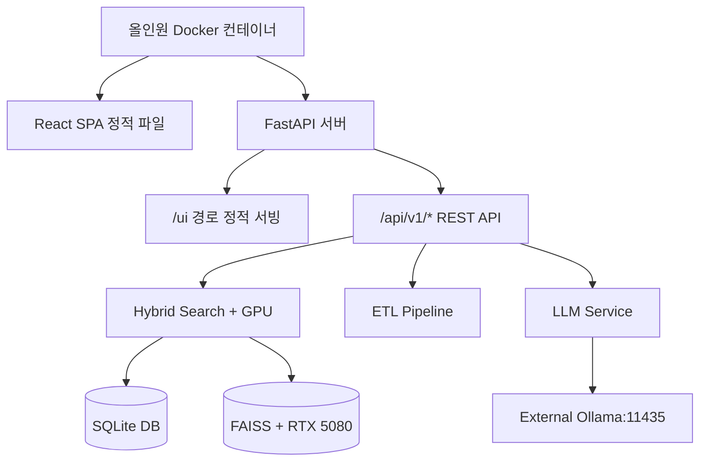

# HanaNaviLite 개발 가이드

이 문서는 HanaNaviLite 프로젝트의 개발 지침과 최종 구현 세부사항을 설명합니다.

---

## 🎯 **개발 철학**

*   **경량화 우선**: 32GB RAM 제약 하에서 최적 성능 달성
*   **자체 구현 중심**: 핵심 비즈니스 로직은 직접 개발
*   **실용성 중심**: MVP 관점에서 필수 기능 구현 및 확장 가능한 모듈 설계

---

## 🏗️ **올인원 아키텍처**

### **단일 컨테이너 구조**

### **간소화된 데이터 플로우**

1.  **인덱싱**: `파일 업로드 → GPU 가속 임베딩 → FAISS/SQLite 저장`
2.  **검색**: `사용자 질의 → GPU 가속 하이브리드 검색 → RRF 융합`
3.  **응답**: `컨텍스트 + 질의 → Ollama LLM → 실시간 스트리밍 답변`
4.  **접속**: `단일 URL (localhost:8011/ui) → 모든 기능 이용`

---

## ✅ **개발 완료 현황**

**모든 개발 단계 100% 완료**

프로젝트의 모든 단계가 성공적으로 완료되었습니다. 핵심 인프라 구축부터 고급 기능 구현 및 UI 통합까지 모든 목표를 달성했습니다.

*   **Phase 1: 핵심 인프라**: FastAPI, SQLite 기반의 안정적인 백엔드 시스템 구축 완료.
*   **Phase 2: 검색 엔진**: FAISS와 SQLite FTS5를 결합한 하이브리드 검색 엔진 구현 완료.
*   **Phase 3: ETL & LLM**: 다양한 문서(HWP, PPTX 포함)를 처리하는 ETL 파이프라인과 Ollama 연동 RAG 파이프라인 구축 완료.
*   **Phase 4 & 5: UI 통합 및 고도화**: Radix UI 기반의 고품질 React UI를 통합하고, 실시간 모니터링 및 다중 채널 모드 등 고급 기능 구현 완료.

---

## 🔧 **핵심 모듈 설계**

### **1. FastAPI Gateway (`app/core/`) - ✅ 완성**
*   **역할**: 모든 요청의 진입점 및 라우팅.
*   **상태**: 완전 구현 완료.
*   **주요 기능**: 라이프사이클 관리, CORS, 전역 예외 처리, 로깅, 헬스체크 API.

### **2. 하이브리드 검색 엔진 (`app/search/`) - ✅ 완성**
*   **역할**: IR (정보 검색)과 Vector 검색을 결합한 통합 검색.
*   **상태**: 완전 구현 완료.
*   **주요 기능**: FAISS 벡터 검색, SQLite FTS5 IR 검색, RRF 융합, 비동기 병렬 검색.

### **3. ETL 파이프라인 (`app/etl/`) - ✅ 완성**
*   **역할**: 데이터 수집, 변환, 적재 자동화.
*   **상태**: 완전 구현 완료.
*   **주요 기능**: 다중 포맷 파일 파서(PDF, DOCX, HWP 등), 텍스트 청킹, 임베딩, 인덱스 업데이트.

### **4. LLM 서비스 (`app/llm/`) - ✅ 완성**
*   **역할**: 언어모델 추론 및 답변 생성.
*   **상태**: 완전 구현 완료.
*   **주요 기능**: Ollama 클라이언트, 프롬프트 엔지니어링, 스트리밍 응답, RAG 파이프라인.

---

## 💾 **데이터 관리**

### **SQLite 통합 스키마**
7개의 테이블(documents, chunks, FTS 테이블 등)으로 구성된 통합 데이터베이스 스키마가 구현되었습니다. 자동 트리거, WAL 모드, 캐싱 등을 통해 성능과 안정성을 확보했습니다.

### **FAISS 인덱스 관리**
`app/search/faiss_engine.py`를 통해 FAISS 인덱스의 생성, 벡터 추가, 검색 및 관리가 이루어집니다. In-memory 방식으로 빠른 속도를 보장합니다.

---

## 🧪 **테스트 전략**

`make test` 명령어로 전체 테스트를 실행할 수 있습니다. 현재 모든 테스트(105/105)가 통과합니다.

*   **단위/통합 테스트**: `tests/` 디렉터리에 모듈별 테스트 코드 포함.
*   **성능 테스트**: `tests/test_performance.py`에서 응답 시간 및 메모리 사용량 검증.
*   **CI/CD**: GitHub Actions를 통해 Push 및 Pull Request 시 자동으로 테스트 및 코드 품질 검사 수행.

---

## 🚀 **배포 및 개발**

`Makefile`에 개발, 테스트, 배포에 필요한 모든 명령어가 포함되어 있습니다.

*   `make install`: 의존성 설치
*   `make dev`: 로컬 개발 서버 실행
*   `make test`: 전체 테스트 실행
*   `make lint`: 코드 품질 검사
*   `make docker-up`: Docker 기반 전체 시스템 실행

자세한 내용은 `README.md` 파일과 `Makefile`을 참고하세요.
